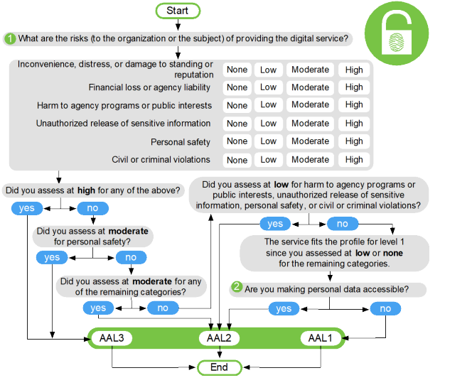
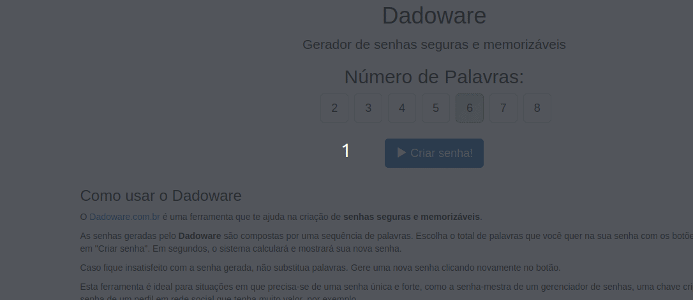

<!--  -->
<!-- [bAqYtvn81bM](https://youtu.be/bAqYtvn81bM) -->

- [O que é Identidade Digital](#o-que-é-identidade-digital)
  - [O problema das Senhas](#o-problema-das-senhas)
  - [Impersonation](#impersonation)
  - [Senha com MFA](#senha-com-mfa)
  - [Autenticação entre aplicações](#autenticação-entre-aplicações)
    - [Aqui temos um problema. Como garantir a identidade digital das aplicações?](#aqui-temos-um-problema-como-garantir-a-identidade-digital-das-aplicações)
  - [Nem todo sistema precisa de autenticação ?](#nem-todo-sistema-precisa-de-autenticação-)
- [O que o NIST recomenda sobre Controle de acesso?](#o-que-o-nist-recomenda-sobre-controle-de-acesso)
  - [Racional aplicado](#racional-aplicado)
  - [Observações importantes](#observações-importantes)
    - [Níveis do NIST](#níveis-do-nist)
    - [Mente aberta para senhas.](#mente-aberta-para-senhas)
  - [Principais Pontos do NIST SP 800-63B](#principais-pontos-do-nist-sp-800-63b)
    - [Complexidade de Senha](#complexidade-de-senha)
    - [Armazenamento das Senhas](#armazenamento-das-senhas)
    - [Cookies de Sessão](#cookies-de-sessão)
    - [Throttling](#throttling)
    - [Reautenticação](#reautenticação)
    - [Recuperação de senhas](#recuperação-de-senhas)
    - [Logs e Auditoria](#logs-e-auditoria)
    - [MFA](#mfa)
  - [Senha com 08 caracteres podem ser quebradas instantâneamente?](#senha-com-08-caracteres-podem-ser-quebradas-instantâneamente)
- [Então como escolher uma boa senha ?](#então-como-escolher-uma-boa-senha-)
- [Conclusão](#conclusão)
- [Fontes e Referências](#fontes-e-referências)

---

{: .prompt-warning }
> Qual problema esse artigo resolve ?

Dá uma olhada nessa senha:

**S&cL1nuxBR10!**

Você acredita que uma senha de 12 caracteres, com simbolos, números e mixagem de caracteres utilizando letras maiusculas e minusculas é uma senha segura? Dá uma conferida nesse artigo que vamos explorar como o SP 800-63 do renomado NIST sugere que não é bem assim não...

Também vamos ver que a expiração de senhas de tempos em tempos (periodicamente) não é necessariamente uma boa prática.

> NIST: National Institute of Standards and Technology
> 
> SP: Special Publication

---

{: .prompt-tip }
> O que vamos fazer?

Vamos discorrer sobre controle de acesso, principalmente referente a senhas. Vamos ver que uma senha só com letras pode ser mais segura que uma senha cheia de caracteres especiais e numeros. Tudo depende da entropia da senha. 

Veremos também todas as principais boas práticas de segurança para senhas.

Também vamos considerar o que o NIST tem a dizer sobre esse assunto, especificamente a publicação [800-63B](https://nvlpubs.nist.gov/nistpubs/SpecialPublications/NIST.SP.800-63b.pdf) que discorre sobre guidelines de identidade digital.

---

# O que é Identidade Digital

Identidade Digital na perspectiva internacional é a forma de você provar que "*você é você através da rede"*. E não é algo simples, muito pelo contrário. É bem dificil conseguir garantir que você é você mesmo através da internet. 

> Em 1993 surgiu o famoso meme "On the Internet, nobody knows you're a dog". Onde Peter Steiner publicou o cartoon acima no "The New Yorker".

O mais interessante é que é verdade. Não há um meio fácil de confirmar para os servidores da internet que você que está lendo esse artigo de fato é você. Pois no fim das contas são só bits e bytes trafegando de uma ponta a outra e existem inúmeras possibilidades de fraudes envolvidas nesse caminho. Estamos falando desde técnicas de Spoofing até MITM (Man-In-The-Middle).

Dito isso, a identididade digital é a forma que busca identificar e confirmar digitalmente alguém.

Isso geralmente é realizado através de "logins" que incluem um usuário e uma senha. A popular "senha".

>Spoofing: Técnicas relacionadas a se fazer passar por outra pessoa. (Falsidade ideologica)
>
>MITM: Técnicas que envolvem interceptar mensagens entre dois ou mais pontos na rede.

## O problema das Senhas

Identificar digitalmente uma pessoa pela senha parece ser uma boa ideia a principio, mas existem **MUITAS** formas de fraudar esse tipo de identificação.

> O uso da senha por definição sugere que você é você pois é algo que você sabe e somente você sabe.

Vamos pausar um pouco aqui e lembrar que existem três principais formas de identificar alguém:

Você é você e eu posso provar que é através desses três fatores:

- Algo que só você sabe. (Ex: senha)
- Algo que só você tem. (Ex: tokens/cartões de acesso)
- Algo que só você é. (Ex: biometria)

Pronto, vamos seguir.

Se alguém descobre sua senha então a internet não poderá identificar com precisão na realidade que você é você, pois não será **algo que somente você sabe**.

A essa altura do campeonato você já deve ter percebido que a prática de roubo de senhas é algo muito em alta dentro do cenário de crimes cibernéticos. E historicamente o usuário não costuma cuidar muito bem de sua senha, seja anotando em um papel, salvando em um grupo do whatsapp, atrás do cartão de crédito.. Enfim..

Se a senha for complexa e exigir numeros, letras maiusculas, pelo menos 1 simbolo e ter mais de 10 caracteres a chance desse usuário anotar essa senha em papel ou notepad é grande. E a chance dessa senha estar na área de trabalho ou na mesa do colaborador é maior ainda.

Também há grandes chances do usuário ao se deparar com uma política de senhas complexa, simplesmente fazer o seguinte:

Senha original: papainoel

Senha "complexa": Papainoel1!

Podemos verificar que a senha "complexa" tem 11 caracteres incluindo letras maisculas, simbolos e numeros.

Mas se fizermos uma rápida consulta em uma base de senhas vazadas como o [haveibeenpwned.com](https://haveibeenpwned.com/Passwords) podemos verificar que a senha já consta como vazada.

Detalhe que a senha está em português, e o banco de dados é internacional. Se modificar a pesquisa para "Santaclaus1!", temos mais ocorrências..

Isso nos faz refletir o quão eficaz é essa mixagem de caracteres.. Não pela técnica de mixagem em si, mas pelo fato do usuário conseguir tornar uma senha que deveria ser forte em uma senha fraca.

>Se você perceber bem, o que o usuário fez foi alterar a primeira letra para maiscula, e adicionou o primeiro numero seguido do primeiro simbolo do teclado tradicional.

Sim, o usuário sempre surpreende, e eu me incluo aqui como usuário pois também já fiz isso.

## Impersonation

É importante saber que "impersonation" ou impersonificação basicamente se resume a alguém tentar se passar por você. Que é exatamente o que queremos evitar com a identificação digital.

Se quiser saber mais detalhes aqui tem um artigo da bitdefender bem explicado: [bitdefender - what is impersonation](https://www.bitdefender.com/blog/hotforsecurity/what-is-impersonation/)

## Senha com MFA

Continuando sobre Senhas... 

Se o problema das senhas é porque é "algo que você sabe" e alguém poderia saber, então podemos dificultar mais as coisas para um atacante e adicionar um novo fator de identificação digital:

Algo que você tem.

O MFA (MultiFactor Authentication) geralmente permite utilizarmos além da senha (algo que você sabe), um token que você tem. Para isso obviamente você precisará ter em mãos esse "token".

Na prática geralmente é um aplicativo instalado no seu celular ou computador que gerará números sempre que você quiser. E esses números serão "algo que você tem" naquele momento da identificação.

Com a senha e o token, temos dois fatores de identificação digital: Algo que você sabe e algo que você tem.

Está ficando melhor! Dessa forma temos mais chances de identificarmos corretamente você e garantir a sua própria segurança e legitimidade.

E para o atacante a dificuldade aumenta significativamente, pois além de conseguir a sua senha, também vai precisar do seu token.

> OBS: O NIST sugere que o dispositivo que contém o token MFA deve ser ativado por senha ou biometria e não deve ser utilizado via SMS (falaremos mais adiante).

---

## Autenticação entre aplicações

Beleza! Senha com MFA é tudo de bom, mas como fazemos para autenticar aplicações ? Como isso funciona no cenário de APIs ?

Nesse caso também precisamos garantir a identidade digital daquela aplicação, **caso contrário um humano pode se passar por ela.** 

>Imagina o estrago que seria um humano ter acesso a uma API que retornar dados pessoais de clientes. Ou com acesso a uma api de cashout de dinheiro ? Vish...

Bom, a aplicação não é viva (ainda) então não temos como perguntar a ela "algo que você sabe". E a aplicação pode até ter um token para utilizar no MFA, mas em algum humano vai precisar configurar esse TOKEN e provavelmente ele vai precisar testar também e a chance desse token ser lido em algum momento, seja nos logs ou seja no banco de dados ou no próprio código fonte é algo a se considerar.

### Aqui temos um problema. Como garantir a identidade digital das aplicações?

Bom, para esses casos, geralmente estamos falando de autenticação entre microserviços.

Existem várias soluções, mas pessoalmente eu acredito que a mais simples e confiável é a abstração da camada de autenticação do serviço ou microserviço em si.

Abstrair todo o fluxo de autenticação/autorização para um servidor que trabalhe com oauth2 ou jwt.

Para simplificar, pois não é o foco desse artigo e esse tema entre microserviços é bem longo... 

Sequência de autenticação
1 - API A quer comunicar com API B
2 - API A faz uma requisição de login para um servidor C
3 - Servidor C retorna sucesso no login e responde com um token de acesso
4 - API A incorpora o token de acesso no body ou header da requisição e comunica com API B
5 - API B valida o token de acesso no servidor C
6 - Servidor C valida o token e retorna 200 ok para API B.

## Nem todo sistema precisa de autenticação ?

É importante deixar claro que o NIST informa que nem todos os serviços digitais precisam de autenticação ou provas de identificação digital.

Você pode consultar no [item 2.1 que fala sobre Aplicabilidade](https://nvlpubs.nist.gov/nistpubs/SpecialPublications/NIST.SP.800-63-3.pdf)

# O que o NIST recomenda sobre Controle de acesso?

## Racional aplicado

Antes de tudo, vale a pena a leitura do trecho abaixo que explica o racional aplicado a complexidade de senha.

Fonte: https://nvlpubs.nist.gov/nistpubs/SpecialPublications/NIST.SP.800-63b.pdf

Trecho na íntegra

Despite widespread frustration with the use of passwords from both a usability and security
standpoint, they remain a very widely used form of authentication [Persistence]. Humans,
however, have only a limited ability to memorize complex, arbitrary secrets, so they often
choose passwords that can be easily guessed. To address the resultant security concerns, online
services have introduced rules in an effort to increase the complexity of these memorized secrets.
The most notable form of these is composition rules, which require the user to choose passwords
constructed using a mix of character types, such as at least one digit, uppercase letter, and
symbol. However, analyses of breached password databases reveal that the benefit of such rules
is not nearly as significant as initially thought [Policies], although the impact on usability and
memorability is severe.
Complexity of user-chosen passwords has often been characterized using the information theory
concept of entropy [Shannon]. While entropy can be readily calculated for data having
deterministic distribution functions, estimating the entropy for user-chosen passwords is difficult
and past efforts to do so have not been particularly accurate. For this reason, a different and
somewhat simpler approach, based primarily on password length, is presented herein.
Many attacks associated with the use of passwords are not affected by password complexity and
length. Keystroke logging, phishing, and social engineering attacks are equally effective on
lengthy, com

## Observações importantes

### Níveis do NIST

Antes de irmos para o que o NIST recomenda, gostaria lembrar que o NIST trabalha com três niveis:

- Authenticator Assurance Level 1 (Nível 1) -> Aplicável para aplicações que não lidam acesso a dados pessoais.

- Authenticator Assurance Level 2 (Nível 2) -> Aplicável para boa parte das aplicações que lidam com dados pessoais e a falha na autenticação leva a um risco mediano de forma geral.

- Authenticator Assurance Level 3 (Nível 3) -> Aplicável para os casos onde a falha na autenticação pode envolver um risco alto relacionado a crimes, danos a interesses públicos, perda financeira, segurança pessoal e outros temas críticos.

Para entender melhor os cenários segue abaixo o diagrama disponibilizado pelo NIST na escolha do Nível a ser aplicado.

---

### Mente aberta para senhas.

Outro ponto que é importante freezar:

É sobre a quantidade de caracteres mínimo para a senha.

Veremos que o NIST recomenda um mínimo de 08 caracteres. O que a princípio pode parecer pouco, e realmente é pouco se levarmos em consideração ataques do tipo brute-force. Entretanto é importante lembrar que associado ao mínimo de 08 caracteres existem outros controles importantíssimos como MFA, consultas em vazamentos e rate limiting para aplicações sem sucesso que mitigam muito esses tipos de ataques.

Se você não for utilizar nenhum desses outros controles, então sugiro que tenha pelo menos 12+, se possível 16+. Mas isso é minha opnião pessoal.

Esclarecido isso, vamos aos princpais pontos da SP 800-63B:

## Principais Pontos do NIST SP 800-63B

### Complexidade de Senha

-  Pelo menos 08 caracteres caso escolhida por humanos ou 06 caso escolhida randomicamente. Com possibilidade de conter até 64 caracteres.
- Habilitar todos os caracteres ASCII possíveis ([RFC-20](https://www.rfc-editor.org/rfc/rfc20.txt)), incluindo espaço.
- Habilitar unicodes também ([IEC-10646](https://standards.iso.org/ittf/PubliclyAvailableStandards/c063182_ISO_IEC_10646_2014.zip))
- Não habilitar dicas de senha (perguntas relacionadas como: "Qual o nome do seu primeiro pet ?")
- Verificar:
  - Se a senha não está exposta em banco de dados de senhas vazadas. Um exemplo seria realizar a consulta da senha na api do [haveibeenpwned](https://haveibeenpwned.com/Passwords).
  - Se a senha não consta no dicionário de palavras.
  - Se não possui sequência de caracteres repetidos como senhasenha ou 1234abcd
  - Se não é um derivativo que abaixa a entropia como: nome do serviço, o próprio username, etc..
- Desabilitar o rotacionamento de senhas periódico. A não ser que tenha evidências que a senha utilizada foi vazada.
- Evitar a obrigação de utilização de diferentes tipos de caracteres como letras maiusculas, minusculas, caracteres especiais, numeros, etc...
- Permitir a colagem da área de transferência no campo de senha, de forma a facilitar a utilização de gerenciadores de senha como bitwarden.
- Permitir que o usuário veja a senha que está inserindo (habilitar o "olhinho"), facilita a memorização. Ao invés dos asterísticos.
- Mostre durante a escolha da senha um medidor de entropia para que o usuário tenha ideia da força de sua senha.

---

### Armazenamento das Senhas
- Todas as senhas devem ser armazenadas com utilização de salt (mínimo 32bits) e hash. (Bons exemplos de algoritmos: SHA3, PBKDF2, Baloon, HMAC, CMAC...)
- A senha do salt deve ser armazenada em outra tabela e deve obedecer o [NIST-131A](https://csrc.nist.gov/news/2019/nist-publishes-sp-800-131a-rev-2).

### Cookies de Sessão
- No caso de sessões ativas, habilite as flags SECURE e HTTP-ONLY
- Configure para expirar após determinado tempo (em aberto a quantidade de tempo)
- Credenciais em cookies devem conter pelo menos 64bits de entropia.

### Throttling
- A autenticação não deve permitir mais de 100 tentativas consecutivas sem bloqueio.
  - Recomenda-se bloqueio de 30s até 01 hora.
- Utilize CAPTCHA
- Whitelisting IP

### Reautenticação
- Pelo menos uma vez a cada 30 minutos em caso de inatividade
- Pelo menos uma vez a cada 12 horas no caso de sessão ativa, independente da atividade do usuário.

### Recuperação de senhas
- Não permita durante o processo de recuperação de senhas que um fator seja usado para recuperar outro fator.
  - Por exemplo: a senha sendo usada para criar um novo token MFA.

### Logs e Auditoria
- Mantenha logs para fins de auditoria pelo tempo necessário previsto nos regulatórios. 
  - Exemplo: BACEN pede 10 anos de retenção para transações financeiras.

### MFA
- MFA com pelo menos 2 fatores.
- Deve ser ativado através de um dos fatores abaixo:
  - Algo que você é
  - Algo que você sabe
- Modelos de MFAs sugeridos pelo NIST:
  - Multi-Factor OTP Device
  - Multi-Factor Cryptographic Software
  - Multi-Factor Cryptographic Device   
- Importante: O MFA deve ser habilitado através de senha ou biometria.

## Senha com 08 caracteres podem ser quebradas instantâneamente?

Se você já viu a imagem abaixou ou similar, você deve estar se perguntando como o NIST pode sugerir uma senha com no mínimo 08 caracteres se em 2019 já havia processamento suficiente para quebrar senhas de 08 caracteres instantâneamente ?

E é uma pergunta muito válida! A questão é que o NIST assim como a maioria dos outros frameworks de padrões de segurança precisam olhar para um agrupamento de controles e não para um item específico.

Se olharmos somente da perspectiva da senha, sim. 08 caracteres é pouco. Mas se entendermos que associado aos 08 caracteres teremos todos os outros controles citados anteriormente e olharmos para o conjunto "senha segura" veremos que 08 caracteres pode ser suficiente.

Outro ponto importante é que nessa imagem de 2019 é subentendido que estamos falando de offline brute-force attack. Não é algo que daria pra fazer de forma trivial pela conexão de rede com um ["john the ripper"](https://github.com/openwall/john) por exemplo. Ou até daria pra fazer mas com certeza não no mesmo tempo disposto na tabela.

Também é importante salientar que os algoritmos recomendados para armazenamento de senhas para os dias de hoje não estão todos citados nessa relação. Por curiosidade vou deixar alguns aqui que são recomendados atualmente:

- ARGO2 (2015 winner)
- PBKDF2 (SASL)
- BCRYPT (Blowfish-based KDF)
- SCRYPT (including hardware porposes)

Fonte: [IETF - Password Storage](https://datatracker.ietf.org/doc/html/draft-ietf-kitten-password-storage-03#name-storage-2)

> OBS: KDF significa Key Derivation Function que basicamente é a forma como o algoritmo transforma a sua senha em uma chave criptografada segura. Para fins didáticos é um hash "turbinado".

# Então como escolher uma boa senha ?

- Bom, se você puder, utilize um gerenciador de senhas seguro
  - Existem vários bons no mercado como bitwarden por exemplo.
  - A maioria dos gerenciadores de senha tem a opção de gerar senhas no estilo "passphrase".
- Não confie no seu cerebro para criar senhas
  - Temos tendência a associar as coisas que temos maior familiaridade e pode propiciar a advinhação.
  - Use geradores automáticos como [diceware](https://dadoware.com.br/)
- Prefira passphrases.
  - São mais aleatórias
  - Fáceis de lembrar (crie uma história para a sua.)
  - geralmente são longas.
- Escolha uma senha única para cada plataforma.
- Sempre que puder, habilite o MFA

A história que eu criei é a seguinte:
"enquanto caloria envio passe rabeca veia" -> **enquanto** queima **caloria** ? Sim, **envio** o **passe** da **rabeca veia**!

Quanto mais divertido for, mais fácil de assimilar.

---

# Conclusão

É incrível como o assunto de senhas já foi tão discutido que pode até parecer básico. Mas sempre traz a tona questionamentos acalorados. Mesmo depois de tanto tempo.

E o NIST com a SP 800-63 foi bem corajoso na minha opnião ao ir contra o que todo mundo entendia como certo e estabelecer padrões que realmente funcionam para melhorar a segurança da identidade digital.

Acredito que observando toda a recomendação do NIST o que mais chama atenção são 3 pontos:

- Não expiração da senha
- 08 caracteres mínimos sem necessidade de mix entre letras, numeros e simbolos.
- Reforço no uso do MFA

Isso mostra que nem sempre ficar adicionando complexidade aumenta a segurança. Por vezes, como é o caso da própria senha, quanto mais complexo pode até mesmo diminuir a segurança devido o fator "usuário".

Se você ainda tiver dúvidas, dá uma conferida em quantas vezes a senha "complexa" "Password1!" já foi vazada no haveibeenpwned (mais de 8000 vezes.)

Bom é isso, espero que tenham curtido, entendido um pouco mais sobre NIST e sobre segurança de senhas de um jeito mais simplificado.

---

# Fontes e Referências

On the Internet, nobody knows youre a dog: https://en.wikipedia.org/wiki/On_the_Internet,_nobody_knows_you%27re_a_dog

Discussão calorosa de uma PR no ASVS: https://github.com/OWASP/ASVS/issues/913

Terahash sobre password recovery: https://twitter.com/TerahashCorp/status/1155112559206383616/photo/1

IETF - Password Storage: https://datatracker.ietf.org/doc/html/draft-ietf-kitten-password-storage-03#name-storage-2 

NIST SP 800-63: https://nvlpubs.nist.gov/nistpubs/SpecialPublications/NIST.SP.800-63b.pdf

Junior, Jorge. "Senhas: vulnerabilidades organizacionais e do usuário" Disponível em: Acerto privado TCC IESAM (Estácio)

Diceware PTBR - https://dadoware.com.br/

HaveIBeenPwned - https://haveibeenpwned.com/Passwords